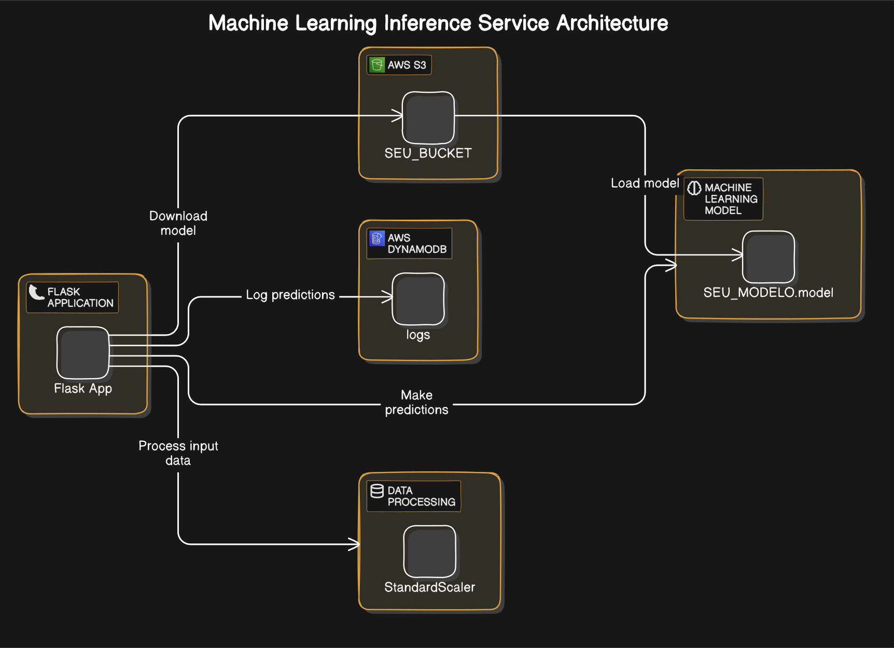
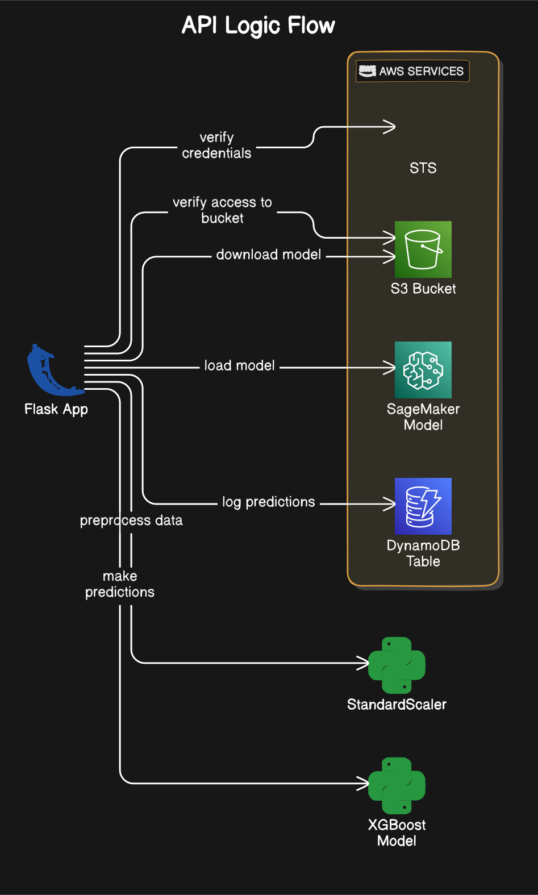
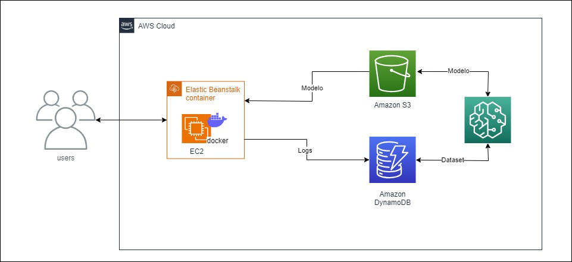

## SOBRE
Modelo de machine learning treinado com SageMaker, capaz de fazer previsões acerca do DATASET HOTEL RESEVARTIONS (<a href="https://www.kaggle.com/datasets/ahsan81/hotel-reservations-classification-dataset">link</a>) - uma api, capaz de fazer inferência no modelo e armazenar logs no DynamoDB com as previsões.

### Tecnologias usadas e suas respectivas versões

- flask 2.0.1
- boto3 1.17.112
- xgboost 1.7.6
- pandas 1.3.3
- scikit-learn 0.24.2
- pydantic 1.8.2
### Arquitetura da lógica utilizada para fazer a inferência no modelo

### Arquitetura da lógica utilizada na API

***

### Construção do Modelo
O modelo foi treinado no SageMaker usando XGBoost

